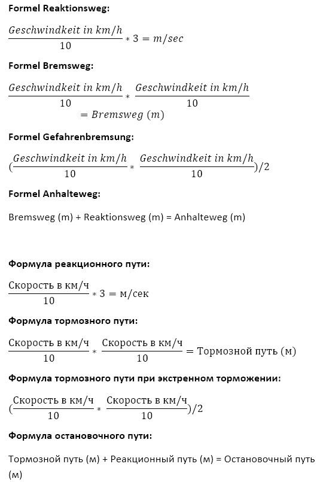

# Автомобиль и все, что с этим связано

ПДД Германии называются Straßenverkehrsordnung (StVO), можно найти на немецком на [сайте](https://www.stvo.de/strassenverkehrsordnung) или неплохой перевод (2010) на [русском](http://levy.com.ru/docs/stvo/)

## FAQ
Q: Я только приехал, у меня есть национальные права своей страны - что мне нужно знать?

A: В зависимости от страны, скорее всего ваши права действительны только первые 6 месяцев, потом их необходимо будет [обменять](#Обмен-прав)

Q: Есть ли разница в правилах моей страны и Германии?

A: Скорее всего есть, для этого рекомендуется даже при замене прав сходить в автошколу и послушать теоретические лекции. Также детали и серые зоны StVO описаны в специальном [разделе](#Разница-в-правилах)

## Получение прав
Как и в любой другой культурной стране, в Германии для вождения автомобиля и других транспортных средств необходимо получить водительское удостоверение (Führerschein). Здесь и далее по умолчанию подразумевается **категория B**, т.е. обычные автомобили с разрешенной максимальной массой не более 3.5т, возможно с прицепом до 750 кг.

### Обучение с нуля
Если вы приехали в Германию, не имея водительского удостоверения, но хотите его получить, вам придется учиться "по полной программе", т.е. ходить на обязательную теорию и откатывать обязательные практические часы, что обычно выливается примерно в 2-3 раза большую сумму, нежели при обмене (~2500 евро против ~800)
### Обмен прав
Права, выданные вне Германии, действуют на территории Германии только первые 6 месяцев после первой прописки (Anmeldung), потом их нужно обменять на немецкие. Обращаем внимание, что *вне Германии водительское удостоверение силы не теряет*, т.е. никто не запрещает ездить в Польшу или Австрию, арендовать машину там и ездить по остальному Евросоюзу по национальным правам.

Требования для замены прав разных государств на немецкие можно найти [тут](http://www.muenchen.de/rathaus/dms/Home/Stadtverwaltung/Kreisverwaltungsreferat/fachspezifisch/HA-III/Dokumente/Fuehrerschein/Staatenliste-Umschreibung-ausl-FS.pdf),  но в целом ситуация такая, что держателям прав РФ, Украины и Белоруссии (по состоянию на 2017) необходимо сдавать и практический и теоретический экзамен, единственное послабление - освобождение от обязательных часов теории и практики.

Процесс замены:
- Записываетесь в автошколу, получаете бумагу с печатью школы
- Проходите курсы первой помощи и проверку зрения
- Подаете комплект документов на подтверждение прав
- Ждете 1-6 недель, как подтверждение получено, записываетесь на теоретический экзамен
- Ждете теоретического экзамена, проходите
- Записываетесь на практический экзамен
- Ждете практического экзамена, проходите
- Получаете вожделенный пластик

Как показывает практика, большая часть времени уходит именно на ожидание терминов и экзаменов.

### Автошколы
* 
  * [Русскоязычные](http://berlin24.ru/firm/avtomobili/avtoshkoli-v-berline/6-45-0.html)
  * [Колибри](http://www.fahrschule-colibri.de/), в районе Rosenthaler Platz, хозяин, и он же инструктор - русскоязычный. Делал пересдачу прав - рекомендую
  * [Fahrschule am Wittenbergplatz](http://fahrschule-am-wittenbergplatz.de), русскоговорящий инструктор, категории А и Б
  * [Англоязычная в Prenzlauer Berg](http://fahrschule-berlin-prenzlauer-berg.de/) - хороший инструктор, очень помогает на экзамене.
  * [Автошкола в Kleistpark](http://fahrschule-avatar.de/) - русскоговорящий директор-инструктор, курсы медпомощи быстро и в любое время
* 
  * [Автошкола 089](https://www.089-fahrschule.de/ru) - крупнейшая русская автошкола в Мюнхене
  * [Автошкола Никитина](http://www.fahrschule-nikitin.de/)

### Заявка на подтверждение прав
Для того, чтобы получить допуск к экзаменам, необходимо отдать ваши права на проверку. Обычно для этого необходимо следующее:
- Справка из автошколы, выдается при регистрации в автошколе
- Справка о прохождении курсов первой помощи (курс проходит целый день, обычно можно пройти в автошколе или рядом), срок действия - бессрочно. Рекомендуемые курсы в Берлине: [1](http://www.drk-intern.de/adressen/drk-kurstermine-suchergebnisse.html) на рус\англ\нем языке и [2](http://www.ersthelfer.tv), проще получить термин на более удобные дни и стоит дешевле.
- Справка о проверке зрения (0.7 и лучше - без очков, меньше 0.7 - нужны очки и будет пометка в правах), срок действия - два года.
- Фотография 3.5*4.5 формата "огромное лицо".
- Оригинал национальных прав
- Ксерокопия национальных прав (Берлин)
- Сертифицированный перевод национальных прав на немецкий (у присяжного переводчика). Без перевода не принимают!

Проверить требуемые документы можно на сайте, там же можно получить термин:
* 
  * https://service.berlin.de/dienstleistung/327537/ часто появлялся в 6:00 или 7:00 на этот же день, иначе бронировать надо очень заранее
* 
  *  [https://www.muenchen.de](https://www.muenchen.de/rathaus/Stadtverwaltung/Kreisverwaltungsreferat/Verkehr/Fuehrerschein/Umschreibungen.html) - сайт с информацией, термины [тут](https://www.muenchen.de/rathaus/terminvereinbarung_fs.html). Для ловли терминов есть [скрипт](https://github.com/GodfatherThe/munich-scripts)

Подтверждение стоит 42.60 евро (2017), оплата при подаче заявления. При подаче вас могут спросить, хотите ли вы сдавать в TUV или в Dekra (10.2017, Мюнхен - не спрашивают). Принципиальной разницы не замечено, но, если спросят, то  рекомендуется выбирать TUV. Срок проверки варьируется от нескольких дней до 16 недель, но обычно 4-6 недель. При подаче оригинал прав забирается. Свои права можно потом вернуть, при получении-сдаче документов надо просто попросить. Можно забрать через 1-2 недели проверки, записавшись на термин еще раз. По состоянию на 2017, в Мюнхене отдают без вопросов, главное, на второй термин прийти с паспортом и бумагой, подтверждающей, что у вас права приняли.

#### Возврат национальных прав
Но бывает, что сотрудник Fahrerlaubnisbehörde начинает утверждать, что права не возвращаются. Способа, как ему доказать, что он не прав, до сего дня никто не обнаружил (разве что идти к другому сотруднику). Рекомендуется сделать копию, пригодится в дальнейшем для проката авто.

Если вам не удалось убедить не забирать насовсем национальные права, то стоит написать [письмо в свободной форме](files/DrivingLicenseReturnTemplate.md) с просьбой вернуть.

**UPD: Мюнхен.** Сентябрь 2017. При выдаче новых немецких прав, отдали и украинские с наклейкой, что выданы немецкие.

**UPD: Берлин.** Май 2018. Спустя полтора года после обмена, подал повторное заявление на возврат белорусских прав. Возвращал на основании, что у меня там была еще категория "А" и я хочу кататься на мотоцикле на родине. Пришел подал заявление в окно, выдали талончик, через минут 10 приняли и вернули права. Все говорят на немецком, кроме одного парня, к которому меня и отправили. [Шаблон подобного заявления на возврат в связи с дополнительной категорией](files/Driving_licence_back.pdf).

**UPD: Берлин.** Март 2018. При подаче заявления, оригинал прав не забрали. По опыту и информации от берлинских знакомых ни у кого не забирают права при подаче в Берлине.

**UPD: Берлин.** Апрель 2018. Пришел забирать права после сдачи экзамена и попросил оставить мне национальные права. Парень сказал, что национальные права возвращают только в том случае, если в них открыта категория, которой нет в немецких правах. Т.е. если в национальных правах открыты категории B и C, а в немецких только B, то можно оставить национальные права.

**UPD: Гамбург.** Август 2017. В ответ на письмо написанное по примеру выше, приходит [ответ](files/russishe_fuererherscein_zuruck.jpg),
что нельзя иметь 2 прав одновременно.

### Теория

Теоретический экзамен состоит из 30 вопросов разной степени "важности" (разное количество "очков"), включая видео-вопросы и вариативные вопросы (суть одна, но меняется картинка, цвет авто или пол пешехода). Общее количество вопросов около 1300 без учета вариаций. Сдача теоретического экзамена возможна на 12 языках, включая русский и английский. Выбор ответов всегда множественный, хотя бы один вариант всегда верен. Для успешного прохождения экзамена нужно набрать не более 10 "очков" (больше ошибок - больше очков), при этом не допускаются две "пятибалльные" ошибки.

При сдачи теории необходимо предоставить подтверждение от Bürgeramt и от автошколы. 
Оплатить пошлину за сдачу теории можно на месте. 
Результат сдачи вам говорят сразу на месте, также выдается бумага-подтверждение сдачи. Если не сдали, то повторная попытка не ранее, чем через две недели.

Место сдачи экзамена можно посмотреть на сайтах [TUV](https://www.tuv.com/de/deutschland/locations/locationsglobal.jsp?location=Berlin&radius=10&topic=18880) или [Dekra](https://www.dekra.de/de-de/standorte/). Но лучше попросить актуальный список конкретно для вашего случая у инструктора, потому что не все офисы предоставляют весь набор услуг.

Программы для подготовки:
* https://www.fuehrerschein-lernsystem.de/main.asp - удобный сайт, показ вариативных вопросов, можно отмечать "трудные" вопросы, разбиение по категориям, мобильные приложения, комментарии к вопросам. Бесплатно можно ответить на 300 вопросов, платная версия от 6 евро на 1 месяц до 40 евро бессрочно. Но только на немецком (можно попробовать перевести Google на английский).
* https://ru.fuehrerschein-bestehen.de - многоязычная программа, от 25 (1 месяц) до 50 евро (3 месяца).
* http://app.fahrschulcard.de/ - софт от автошкол, есть русский, ищите логин\пароль у товарищей (по имеющейся информации, аккаунты действуют 2 года после регистрации) или покупайте у школы (около 70 евро)
* http://www.fahren-lernen.de/ - Также хорошая программа. Онлайн зарегистрироваться нельзя, нужно идти в любую автошколу, платить за регистрацию для получения имени / пароля

**На каком языке сдавать теорию?**
Логично предположить, что если вы знаете немецкий на достаточном уровне, то лучше сдавать в оригинале - можете быть уверены в отсутствии погрешностей перевода.
Насчет русского языка для теории - в целом, проблем не возникает. Есть единичное число вопросов, где из-за перевода изменяется смысл вариантов ответа, но таких вопросов - буквально пара из всего списка. Конкретные примеры: 1.2.19-113 и 2.5.01-010.

 **Формулы расчёта остановочного пути**
 Среди вариантов имеется много различных вопросов про тормозной, остановочный и реакционный путь. Для этого используется формула:

 

### Практика
Практический экзамен длится ~45 минут и включает в себя технические вопросы перед началом движения (как проверить уровень масла, где включаются габаритные огни, как проверить шины и т.п.), движение по городу (в том числе в зонах 30) и движение по автобану.
Одно из самых важных и непривычных нашему брату требований на экзамене - вертеть головой, т.н. Schulterblick. Проверять обстановку по зеркалам недостаточно, нужно четко поворачивать голову налево на 90 градусов (начало движения, повороты  и перестроения налево и пр.) и направо через плечо, смотря в окно задней правой двери (повороты и перестроения направо и пр.), чтобы экзаменатор увидел, что вы крутите головой.

### Прочее

Отчет по замене прав - http://ewgrafus.livejournal.com/36265.html

Некая "инструкция" - http://fahrschule-berlin-prenzlauer-berg.de/german%20driving%20license%20exchange.html

**Когда я сдал экзамен, мне сразу выдадут пластик на месте?**

Только для новых прав, и в зависимости от земли. 

При замене прав должны забрать прежние. Экзаменатор не имеет права этого делать, поэтому выдают новые права и забирают старые в офисе.

Новые права в NRW могут выдать на месте. В Берлине после сдачи на месте выдают бумажку розового цвета, которая заменяет права на территории Германии. Пластиковые права будут готовы через 2-3 недели. Перед тем как ехать забирать права, лучше позвонить или задать вопрос в [форме для контакта](https://www.berlin.de/labo/mobilitaet/fahrerlaubnisse-personen-und-gueterbefoerderung/formular.264669.php), чтобы точно уточнить, готовы они или нет. В Берлине права выдают по адресу Puttkamerstr. 16 - 18, 10958 Berlin. [Страница сервиса](https://service.berlin.de/standort/121646/)

## Прокат и Car Sharing
### Прокат авто:
- Ксерокопию украинских/российских прав всегда берите с собой при прокате автомобиля, так как в немецких правах не стоит никакой отметки о предыдущем опыте вождения. Данная ксерокопия докажет, что у вас есть опыт вождения авто.
- Фирмы, в которых можно арендовать авто:
  - [drivy](https://www.drivy.de) - аренда авто частных лиц, дешево
  - [Buchbinder](https://www.buchbinder.de/)
  - [Robben & Wientjes](http://www.robben-wientjes.de/) - в том числе можно арендовать авто для самостоятельного переезда или перевозки груза (с российскими правами на пластике, с переводом - отказали в аренде, требовали европейские).
  - https://www.billiger-mietwagen.de/   (агрегатор сервисов по прокату авто)
  - http://eurocar.de
  - http://sixt.de - есть свидетельства двух знакомых о непомерных аппетитах на залоговую часть. Дерут за уже имеющиеся царапины и любые другие моменты. Есть мнение, что лучше обходить товарищей стороной. (не приняли Visa Electron белорусского банка. Сказали, что даже если бы оплатил онлайн, то все равно бы не выдали машину (зато в https://www.enterprise.de с этой же Visa Electron проблем не было))
  - https://de.drive-now.com (смотри ниже)
  - https://www.car2go.com/DE/en/
  - https://www.flinkster.de
  - https://mietwagen.check24.de/

### DriveNow
- www.drive-now.com Есть английская версия сайта и приложения.
- Работает в Берлине, Мюнхене, Кельне, Дюссельдорфе, Гамбурге (по состоянию на апрель 2016).
- Предоставляет возможность аренды классных BMW и Mini поминутно.
- Средняя стоимость аренды 33 цента в минуту. [Существует](https://www.drive-now.com/de/en/pricing/) множество пакетов и бонусов.
- Регистрация стоит 29 Euro. Но можно зарегистрироваться за 9,98 Euro используя код YWELGBBXSU на [немецкой](https://www.drive-now.com/de/de) версии сайта (на английской - код иногда не работает). С этим кодом дают еще 15 минут поездок на счет (буду благодарен, если кто-нибудь воспользуется этим кодом).
- Для регистрации необходимо (об этом не сказано на сайте, но требуют в офисе):
  - Водительское удостоверение (украинское также подходят, но только на 5-6 месяцев)
  - Водительское удостоверение (белорусские права не подходят, требуют интернациональные. Вероятно и украинские не примут, лучше уточнить *upd 23.10.2017*)
  - Банковская карта (использую VISA карту белорусского банка, но можно привязать и Giro Card (но у них офисе))
  - Немецкая Регистрация.
- После регистрации онлайн идете в любой их офис и показываете вышеперечисленные документы, после чего Вам дают карту DriveNow. Она нужна для открытия, закрытия, парковки автомобиля.
- В стоимость входят парковка, топливо, страховка (франшиза 350 Euro).
- Машины ищете, через приложение или просто на улице.
- В Берлине почти во всех BMW есть детские сидения-бустеры.
- Оставлять можно в любом разрешенном для парковки месте в черте города (Business area). Google Map с этой картой области можно скачать здесь: [Берлин](https://api2.drive-now.com/geodata/6099/6099.kml), [Мюнхен](https://api2.drive-now.com/geodata/4604/4604.kml), [Дюссельдорф](https://api2.drive-now.com/geodata/1293/1293.kml),  [Гамбург](https://api2.drive-now.com/geodata/40065/40065.kml). Область можно добавить себе в Google Maps. За пределами Business Area есть несколько выделенных парковок, например в Берлине это Аэропорт Tegel (+€6 за парковку) и Ikea Lichtenberg.

### car2go
- https://www.car2go.com/DE/en/
- Работает в Германии, Австрии, Италии, США и других странах. В Германии в Берлине, Франкфурте, Гамбурге, Мюнхене и др.
- Предоставляет возможность аренды Mercedes различных классов, начиная от Smart'a (26 центов/мин) и заканчивая CLA/GLA (34 цента/мин). Парковка и топливо включены в цену аренды. Подробнее о ценах и взимаемых платежах читайте в разделе Pricing для своего города.
- Регистрация стоит 9 Euro. Можно зарегистрироваться бесплатно и дополнительно получить 30 бесплатных минут используя промокод 15C3EN12030_ewgraf@gmail.com (буду благодарен, если кто-нибудь воспользуется этим кодом).
- Регистрация проходит полностью онлайн, из документов попросили разве что загрузить для проверки фотографию прав. Могут попросить прийти в офис и показать права и регистрацию (Anmeldung). Делают все достаточно быстро. Как только права проверят, можно сразу пользоваться, все операции с машиной делаются через приложение в телефоне.
- Парковаться можно в пределах домашней зоны, обозначенной в приложении в любом разрешенном для парковки месте. На частных парковках парковаться нельзя, есть парковочное место Аэропорту Tegel.
- В стоимость входят парковка, топливо, страховка (франшиза довольно высокая - €500 для Smart и €1000 за Mercedes, будьте аккуратны).

### Oply carsharing
- https://www.oply.com/
- Гамбург и Мюнхен (на февраль 2019)
- 35 евро на 12 часов (45 евро на сутки) или 6 евро в час - Ford C-Max или Ford Fiesta.
- 59 евро на 12 часов (75 евро на сутки) или 9 евро в час - Mazda MX-5 или Reno Traffic.
- Закончить поездку можно только в том же районе, где взяли машину.
- Включено 150 километров на всю поездку, превышение 0.19 €/км.

### Miles (бывшие drive by)
- https://miles-mobility.com/
- Каршеринг от VAG
- Основные отличия:
  - онлайн активация - не нужно ходить в офис подтверждать личность
  - гибридная система оплаты (километры или/+ минуты)
  - есть минивэны (тариф L) - это либо 8-ми кубовые VW T6 или 12-кубовые VW Crafter.
- В стоимость входят парковка, топливо, страховка (франшиза - €1000, будьте аккуратны).
- Промо код 51MpOVbv

## Свое авто

### Покупка авто

Как и везде, перед покупкой необходимо для себя решить базовые фундаментальные вопросы "какая машина?", "новая или б/у?", "у частника или у дилера/перекупа?". Если на первые два вопроса вы должны ответить самостоятельно, то про перекупов в Германии можно написать отдельно.

Большая часть объявлений - это именно перекупы, т.н. хэндлеры (Händler). Что у них хорошего - что они *обязаны* предоставлять гарантию на автомобиль. Обычно такая гарантия - год, из которых первые полгода вы можете жаловаться и именно дилер должен доказывать, что поломка случилась по вашей вине (что почти нереально), а вторые полгода уже вы обязаны доказывать, что поломка случилась по вине дилера (что тоже почти нереально). Поэтому можно считать, что гарантия - полгода. Также некоторые дилеры могут предлагать расширенную гарантию, возможно, за дополнительную плату. И да, все это распространяется на б/у автомобили.
Если же вы покупаете авто у частника (privat), то по умолчанию он никаких гарантий не предоставляет, также в типовом ДКП это может быть прописано явно.

Вне зависимости от продавца, обращайте внимание на техосмотр (TUV). Идеальный вариант - если TUV был сделан недавно (1-2-3 месяца назад) или если продавец согласен сделать новый при продаже. Если же TUV истекает через полгода и продавец отказывается делать новый - лучше дважды подумать, есть все шансы получить "ведро", не допущенное к движению.

Единой формы ДКП здесь нет, но на сайтах-площадках и на сайте ADAC ([ссылка](https://www.adac.de/der-adac/rechtsberatung/musterkaufvertraege-musterformulare/vorlagen/)) можно обнаружить типовые шаблоны договора на все случаи жизни. Интересно отметить, что местный договор содержит значительно больше деталей, нежели на родине. Например, здесь продавец подписывается под текущим пробегом и утверждениями вроде "в такси не использовалась, повреждений не имеется, в ДТП машина не была". Соответственно, если обнаружится, что продавец сознательно умолчал о "темных" моментах из истории авто, то есть все шансы на возврат денег и расторжение договора (консультируйтесь с адвокатами!)
При заключении договора стандартным является выплата некого "аванса" на месте (100-500 евро), что, естественно, должно быть отмечено в договоре. Основную часть суммы продавец может попросить перевести на его счет, соглашаться или же настаивать на передаче наличными - ваше дело. В любом случае, не передавайте ни цента никаким образом, пока договор в двух копиях не подписан.

У каждого дилера обычно есть красные номера - с ними на машине можно покататься и почувствовать машину. Если не дают покататься на машине, то, как и везде, лучше 10 раз подумать.

Крупнейший сайт http://www.mobile.de/, частные объявления там же. Есть еще http://autoscout24.de.

Очень много раскидано дилеров по городу, обычно ближе к промзонам, торгуют подержанными/комиссионными авто. Пробеги тоже скручивают. Некоторые дают гарантию, некоторые нет. В общем все как везде, без человека, который разбирается в машинах, можно попасть. Да и с человеком тоже рулетка.

Руководство по покупке http://www.tupa-germania.ru/avtomobil/pokupka-avtomobilja.html

### Регистрация автомобиля
Регистрация авто или постановка на учет называется Kfz-Zulassung.

В отличие от России, где номерной знак привязан к машине, здесь номерные знаки больше привязаны к владельцу, поэтому в большинстве случаев при покупке б/у авто продавец оставит существующие номера себе, и вам придется делать новые при постановке на учет. Но сохранение номерных знаков также возможно, но только в случае продажи в том же регионе (пруф?), можете попробовать договориться с продавцом. Но все же в большинстве случаев вам придется получать новые номера (или использовать свои же с предыдущей машины). При желании возможно выбрать себе любой из свободных автомобильных номеров (wunschkennzeichen). Это увеличит стоимость регистрации примерно на 12.8 евро. Для этого желательно до похода на регистрацию зарезервировать желаемый номер онлайн (см. ссылки на региональные страницы ниже) и взять с собой распечатку-подтверждение с выбранными номерами, но также можно сказать об этом прямо в момент постановки на учет.

Для регистрации автомобиля необходимы следующие документы:
- Паспорт (Personalausweis, Reisepass)
- В некоторых случаях может потребоваться регистрация по месту жительства (Meldebestätigung über den Wohnsitz) лица, на которого производится регистрация (Мюнхен, 2018 - не требуется);
- Две зеленые бумаги об автомобиле Zulassungsbescheinigungen Teil I и Zulassungsbescheinigungen Teil II;
- Заключение о техническом осмотре, он же TUV или Hauptuntersuchung;
- Подтверждение из страховой компании о том, что они готовы вас принять к страхованию (Kfz-Haftpflichtversicherung). Обычно это просто код, его и достаточно;
- SEPA-мандат для уплаты налога на автомобиль. [Здесь](https://www.bundesfinanzministerium.de/Web/DE/Service/Apps_Rechner/KfzRechner/KfzRechner.html) можно подсчитать сколько примерно выйдет;
- Старые номерные знаки (Kennzeichenschilder), если машину забирали с ними;
- Новые номерные знаки (можно изготовить на месте в десятке контор рядом с учреждением либо же заказать заранее онлайн, выйдет несколько дешевле).

После завершения процедуры вы должны получить:
- Новое свидетельство о регистрации (Zulassungsbescheinigungen Teil I);
- Внесение ваших данных в ПТС (Zulassungsbescheinigungen Teil II), если необходимо, на дополнительном листе;
- Наклейки на номерах: региональная на обоих и наклейка техосмотра на заднем
- (при смене номера) Umweltplakette - "эко-стикер", наклейка, соответствующая классу экологичности авто, необходимо приклеить в правую нижнюю часть ветрового стекла.

Общая стоимость постановки на учет может варьироваться от региона к региону, но можно опираться на сумму в ~60 евро: 30 евро регистрация, 20 евро изготовление пары номеров, 12 евро выбор произвольного номера, 6 евро Umweltplakette.

Регистрация автомобиля также возможна по доверенности. Бланк доверенности можно скачать [здесь](https://www.adac.de/-/media/adac/pdf/jze/musterkaufvertraege/vollmacht-zulassung-fahrzeuges.pdf).

Также не забывайте, что при переезде вы обязаны уведомить государство и внести изменения в документы на авто (в случае смены региона также возможно поменять номера).

**Различные полезные ссылки**:
* 
  * [Адреса учреждений](https://service.berlin.de/standorte/kfz-zulassungsstellen/)
  * [Бронирование автомобильного номера](https://www.berlin.de/labo/kfz/dienstleistungen/wunschkennzeichen/wkz01)
  * [SEPA-мандат для уплаты налога](https://www.formulare-bfinv.de/ffw/action/invoke.do?id=032021)
* 
  * [Страница услуги](https://www.muenchen.de/rathaus/Stadtverwaltung/Kreisverwaltungsreferat/Verkehr/KFZ-Zulassung.html)
  * [Онлайн-термины](https://www.muenchen.de/rathaus/terminvereinbarung_bb.html). Также можно без проблем отстоять в живой очереди.
  * [Бронирование автомобильного номера](https://www10.muenchen.de/WuKe/)
  * [SEPA-мандат для уплаты налога](http://www.muenchen.de/rathaus/dms/Home/Stadtverwaltung/Kreisverwaltungsreferat/fachspezifisch/HA-III/Dokumente/Kfz-Zulassung/SEPA_Mandat_V_1_2_weiden.pdf)

С февраля 2018 регистрация по живой очереди в Берлине невозможна. По состоянию на апрель 2018 сделать термин онлайн также нельзя, необходимо приехать на станцию (или позвонить по телефону) и записаться.

### Техосмотр
Раз в 2 года необходимо делать техосмотр автомобиля (для новых авто первый техосмотр делается через 3 года). Занимаются техосмотром 2 организации - TUV и DEKRA. Проверяется техническое состояние автомобиля и выбросы вредных веществ. Цена вопроса - 92 евро (TUV, 2017). Также можно обратиться в автомастерскую, которая займется этим вопросом и сможет сразу устранить возникшие проблемы.

Узнать, когда проходить ТО можно по плакетке на заднем номере:

В центре - год, напротив 12 часов - месяц. За просрочку более 2-х месяцев полагается штраф, также интернеты пишут, что с просроченным ТО перестаёт действовать страховка.

В интернете много информации про подготовку к техосмотру, но неплохо рассказано в ролике Дениса Рэма:
https://www.youtube.com/watch?v=-q30u66fJrs. Из основного - отсутствие сквозной ржавчины, сколов на стекле, работа светооборудования (а так же коррекция угла наклона фар), тормозов, состояние подвески, отсутствие подтёков масла, работа ремней. Ну и конечно - на каждый тюнинг нужны свои документы. Можно заехать на станцию и попросить сделать быстрый осмотр - стоит не дорого, и может помочь принять обдуманные решения по ремонту, если потребуется.

Мой опыт - осознав, что я просрочил ТО на 2 месяца (неправильно прочитал плакетку), я вечером сделал термин на следующее утро. Для этого я воспользовался сайтом https://www.tuv.com/de/deutschland/pk/auto_und_verkehr/pruefstellen/suche.jsp. Приехав на полчаса раньше (как раз на открытие), я спросил, стоит ли мне ждать. Эксперт сказал, что можно заезжать. Первым делом он подключил диагностическое оборудование, проверил выбросы газов, работу светооборудования, регулировку уровня. Дальше проверил работу тормозов, ручного тормоза. Потом поднял, посмотрел подвеску, подтеки, тормозные диски - опустил машину и наклеил новую плакетку :) Так же распечатал документ с результатом осмотра и советами по эксплуатации. На все ушло минут 20-30

### Страховка (KFZ-Versicherung)
  Как и во многих других странах, в Германии каждый водитель автомобиля обязан иметь страховку перед третьими лицами (местное ОСАГО, Kfz-**Haftpflicht**). Кроме минимальной страховки, еще существует т.н. Teilkasko и Vollkasko (КАСКО). Teilkasko обычно покрывает только угон, взрыв, шторм и прочие форс-мажоры; тогда как Vollkasko - любые повреждения вашего автомобиля.

  В Германии также действует система коэффициентов бонус-малус (Schadenfreiheitsklasse, SF-класс). Но, в отличие от унификации скидки на государственном уровне (например, как в РФ), здесь каждая страховая может устанавливать размер скидки самостоятельно в некоторых пределах. Также каждая страховая имеет свои алгоритмы пересчета класса после страхового случая (таблица называется **Rückstufungstabelle**)

Если у вас имелся опыт безаварийной езды на родине, то некоторые немецкие страховые позволяют зачесть его в Германии. Например, вот [инструкция](http://asdcode.de/blog/de_bureaucracy/64.html) для HUK24.

Все страховые в Германии предоставляют страховку по всем странам, участвующим в программе Green Card в рамках обычной страховки. При этом, если вы перемещаетесь по ЕС, то никаких дополнительных документов иметь не требуется, но если вы едете в Россию, Украину, Турцию, Беларусь, Молдавию - вам необходимо запросить у вашей страховой эту самую Green Card, обычно ее высылают бесплатно. Но даже в ЕС рекомендуется иметь зеленую карту с собой, во избежание конфузов и проблем.

Как выбрать страховую? Можно пойти на check24.de и сравнить варианты, также популярностью пользуется [HUK24](https://www.huk24.de/versicherungen/kfz-versicherung/autoversicherung.jsp?nmfrom=hauptnavigation). Как отмечено выше, рекомендуется обращать внимание не только на итоговую стоимость, но и на размер скидок по SF и на изменение класса после страховых случаев.

### Покупка запчастей (аналог Exist)
https://www.kfzteile24.de/

### Парковка

В Берлине (Кельне, возможно в других городах тоже) возможна парковка в своей жилой зоне за 20.5 евро за 2 года. Называется Bewohnerparkausweis. Страница услуги [здесь](https://service.berlin.de/dienstleistung/121721/).

## Разница в правилах

Disclaimer 0: настоящий текст не является юридически значимым, не надо ссылаться на него, если вы идете в суд.

Disclaimer 1: разница отмечена сравнением ПДД РФ и StVO. При написании предполагается, что читатель знаком с ПДД РФ редакции 2016-2017 годов.

Disclaimer 2: ссылки на решения судов приводятся на публичные ресурсы, почти все темы, к которым приводятся ссылки, неоднозначны и возможны долгие обсуждения, решений судов обычно сильно больше, чем одно. Написанное здесь - пища к размышлению и ключевые мысли, по которым можете поискать детали, а не заведомо верные утверждения.

Disclaimer 3: напоминаем, что по умолчанию подразумевается **категория B**, т.е. обычные автомобили с разрешенной максимальной массой не более 3.5т, возможно с прицепом до 750 кг.

Прежде чем переходить к списку различных моментов, хочется отметить несколько общих идей, которые прослеживаются в ДД Германии:
- Большая часть площади городов зачастую является "зоной 30", жилые районы. Рекомендуется следить за пешеходами, детьми и "слепыми" перекрестками.
- Наличие большого количества нерегулируемых перекрестков без установленных знаков приоритета. Особенно это заметно в вышеупомянутых зонах 30. Соответственно, рекомендуется никогда не забывать про "помеху справа".

**Левый поворот**: левые повороты нужно совершать, используя разъезд *правыми* бортами [§9.4][StVO_9]

**Круговое движение, приоритет**: вопреки распространенному заблуждению, наличие знака 215 ("Круговое движение") самого по себе **не дает преимущество** ТС, движущимся по кругу. С другой стороны, немецкий "гост" предписывает также устанавливать знак 205 ("Уступи дорогу") или 209 ("Только направо") на въездах на круг. [ч. 3, Zu Zeichen 215 Kreisverkehr][roundabout]

**Круговое движение, поворотник**: использование поворотника при въезде на круговое движение явно запрещено ([§8.1a][StVO_8]).

**Зона действия главной дороги**: знак 306 ("Главная дорога") заканчивает свое действие *только* со знаками 307 ("конец главной дороги"), 205 ("Уступи дорогу") и 206 ("Стоп"). Другими словами, перекрестки не отменяют действие знака "Главная дорога" ([ч.5, Zu den Zeichen 306 und 307 Vorfahrtstraße und Ende der Vorfahrtstraße][StVO_VwV])

**Светофоры**:  Если горит стрелка на доп. секции светофора, то это гарантирует, что ваша траектория не будет ни с кем пересекаться (т.е. другому транспорту и пешеходам обязательно будет красный). [§37.1, Grüner Pfeil][StVO_37]

**Светофоры**: при наличии зеленой стрелки в виде таблички (в верхней правой части светофора, рядом с красным светом; знак 720) разрешен поворот направо на красный (как в США), остановившись перед светофором и уступив всем дорогу. [§37.1, Grünpfeil][StVO_37]

**Приоритет**: в случае сужения дорог и окончания полосы, ТС, движущиеся по основной полосе, обязаны дать въехать ТС с заканчивающейся полосы (по принципу "молнии"). Т.е. то, что вы движетесь прямо и не совершаете маневров не дает вам преимущества перед теми, у кого закончилась полоса ([§7.4][StVO_7])

**Выбор полосы движения**: в населенном пункте действует свобода выбора полос (freie Fahrstreifenwahl) вне зависимости от общего числа полос ([§7.3][StVO_7])

**Выбор полосы при повороте направо, поворот направо с нескольких полос**: не регламентировано ПДД, но есть решения Берлинского суда [раз](https://www.verkehrslexikon.de/Texte/Abbiegen9.php) и [два](https://www.verkehrslexikon.de/Texte/Abbiegen1.php) о том, что (1) при повороте направо вы можете выбирать любую полосу, (2) при наличии нескольких полос, поворачивающих направо, безусловное преимущество имеет поворачивающий с крайней правой и (3) изменение полосы в процессе поворота не является перестроением. Юридические линки на juris [раз][right1], [два][right2], [три][right3]

**Выбор полосы при повороте налево, поворот налево с нескольких полос**: не регламентировано ПДД. Считается (кем?), что применимы те же правила, что при повороте направо, т.е. вы можете выбирать любую полосу. Рекомендация: с крайней левой поворачивать в крайнюю левую, со второй полосы - право выбирать полосу из оставшихся.

**Стрелки-разметки, полоса без стрелок, Neutraler Fahrstreifen**. Пример: три полосы на перекрестке в одном направлении, на правой стрелка-разметка "только направо", на левой стрелка-разметка "только налево", на средней стрелок нет. Средняя полоса - т.н. Neutraler Fahrstreifen. Куда можно ехать со средней полосы? ПДД не регламентировано, точнее, по букве ПДД вы не имеете права с этой полосы поворачивать вообще ([§9.1][StVO_9]), но считается (кем? W.Bouska?), что с этой полосы можно ехать во всех направлениях, как на соседних стрелках. Такие конфигурации перекрестков присутствуют в Мюнхене, Нюрнберге и Штутгарте.

**Обгон**: понятие "обгона" не регламентировано ПДД, подразумевается любое опережение (не обязательно "связанное с выездом на встречную полосу"). По умолчанию, обгон справа запрещен ([§5.1][StVO_5]), за исключением:
  * обгона поворачивающих налево ([§5.7][StVO_5]),
  * обгона трамваев ([§5.7][StVO_5]),
  * движения в плотном потоке ([§7.2][StVO_7]),
  * движения в населенном пункте с правом выбора полосы ([§7.3][StVO_7]),
  * при наличии разметки, разделяющей направления, например, на автобанах ([§7a.1][StVO_7a]), в том числе на полосе разгона,
  * обгона на регулируемых перекрестках,
  * обгона велосипедистом других участников ДД ([§5.8][StVO_5]).

**Остановка и стоянка**: в целом список мест, где запрещена остановка и стоянка, заметно отличается, поэтому лучше просто посмотрите [§12.1][StVO_12] и [§12.3][StVO_12]. Интересный пример - остановка на перекрестке разрешена.

**Автобусы**: запрещен обгон автобусов, подъезжающих к остановке с включенной аварийкой ([§20.3][StVO_20]).

 **Автобусы**: проезжать мимо остановившегося на выделенной остановке автобуса можно только осторожно, это также действует для встречных машин ([20.1][StVO_20]).  Если у стоящего автобуса включена аварийка, то "осторожно" превращается в "с шаговой скоростью", также действует для встречки ([§20.4][StVO_20])

 **Автобусы**: при наличии автобуса на остановке пешеходы могут перебегать к нему дорогу и имеют преимущество ([§20.2][StVO_20], [§20.4][StVO_20])

**Задний ход**: движение задним ходом на перекрестках разрешено, равно как и в любых других местах, кроме автобанов ([§18.7][StVO_18]) и движения в обратном направлении на односторонних улицах, за исключением заезда на парковочное место (не регламентировано StVO, но есть [решение Берлинского суда](https://www.verkehrslexikon.de/Texte/Rspr6405.php)

 **Велосипедисты**: поворот налево на перекрестках разрешен ([§9.3][StVO_9])

 **Переходы**: "зеброй" отмечаются только нерегулируемые пешеходные переходы вне перекрестков, на перекрестках - просто пунктирная разметка. [ч.4.1, Zu § 26 Fußgängerüberwege][StVO_VwV]

 **Буксировка**: аварийка должна быть включена на обоих ТС ([§15a.3][StVO_15a]), водитель за рулем буксируемого авто не обязан иметь прав ([линк][towing1]).

 [StVO_5]: https://www.stvo.de/strassenverkehrsordnung/93-5-ueberholen
 [StVO_7]: https://www.stvo.de/strassenverkehrsordnung/95-7-benutzung-von-fahrstreifen-durch-kraftfahrzeuge
 [StVO_8]: https://www.stvo.de/strassenverkehrsordnung/96-8-vorfahrt
 [StVO_7a]: https://www.stvo.de/strassenverkehrsordnung/167-7a-abgehende-fahr-einfaedelungs-und-ausfaedelungsstreifen
 [StVO_9]: https://www.stvo.de/strassenverkehrsordnung/97-9-abbiegen-wenden-und-rueckwaertsfahren
 [StVO_12]: https://www.stvo.de/strassenverkehrsordnung/99-12-halten-und-parken
 [StVO_15a]: https://www.stvo.de/strassenverkehrsordnung/175-15a-abschleppen-von-fahrzeugen
 [StVO_18]: https://www.stvo.de/strassenverkehrsordnung/102-18-autobahnen-und-kraftfahrstrassen
 [StVO_20]: https://www.stvo.de/strassenverkehrsordnung/179-20-oeffentliche-verkehrsmittel-und-schulbusse
 [StVO_37]: https://www.stvo.de/strassenverkehrsordnung/117-37-wechsellichtzeichen-dauerlichtzeichen-und-gruenpfeil

 [right1]: https://connect.juris.de/perma?d=KORE562062010 "Vorrang beim parallelen Rechtsabbiegen auf einer zweispurigen Abbiegespur, AG Berlin-Mitte, Urteil vom 16 April 2010 - 111 C 3065/09 -, juris"
 [right2]: https://connect.juris.de/perma?d=KORE409772004 "Sorgfaltspflichten beim parallelen Rechtsabbiegen, KG Berlin, Urteil vom 28. Juni 2004 – 12 U 89/03 –, juris "
 [right3]: https://connect.juris.de/perma?d=KORE305082007 "Sorgfaltspflichten des Fahrzeugführers bei mehrspurigem parallelem Abbiegen nach rechts, BGH, Urteil vom 12. Dezember 2006 – VI ZR 75/06 –, juris"

 [towing1]: https://www.verkehrslexikon.de/Module/Schleppen_und_Abschleppen.php "Der Führer des abgeschleppten Fahrzeugs benötigt keine Fahrerlaubnis, ist aber für das Bremsen und Lenken wie ein Fahrzeugführer verantwortlich."

 [roundabout]: http://www.sicherestrassen.de/VKZKatalog/Kat215.htm
 [StVO_VwV]: http://www.verwaltungsvorschriften-im-internet.de/bsvwvbund_26012001_S3236420014.htm

 **Особенные знаки**

 На дорогах Германии можно встретить знак автозаправки (tankstelle), но с дополнительной надписью:
 - CNG природный газ https://t4.ftcdn.net/jpg/00/47/23/19/500_F_47231905_GAkzol8t2KYvpqpQyF3qFlTCxyuDKXdR.jpg
 - LPG сжиженный газ https://t3.ftcdn.net/jpg/00/08/26/22/500_F_8262244_Vx8ZHqmOfhjrbTXKX2Ia3T2vw2lsuwgF.jpg
 - H2 водородная АЗС https://www.strassenausstatter.de/wp-content/uploads/2017/07/verkehrszeichen-365-66-wasserstofftankstelle.jpg
 - Stromtankstelle станция электрозаправки https://www.schilder-versand.com/assets/gfx/product/300x300/ladestation-fuer-elektrofahrzeuge-verkehrsschild-vz-365-65-21815-c8tlC-1509031206.png
 - Также встречается необычный знак: P+R = Parken und Reisen = Парковка с возможностью пересесть на общественный транспорт ("Парковка + путешествие") http://www.strassenschilder.de/images/signs/parken-und-reisen-park-and-ride.jpg

## Штрафы
Официальный каталог на [немецком](https://www.bussgeldkatalog.org/) и, возможно неактуальный, каталог на [русском](http://auto.germany.ru/pravo/buskatalog.html)
